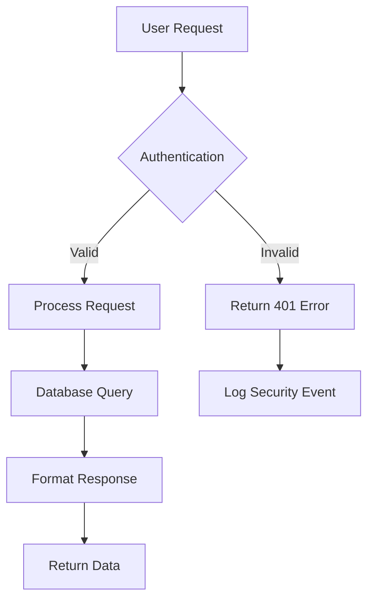

# Visual Design for Documentation

Good visual design in documentation isn't about making things pretty—it's about making complex information easier to understand and act upon.

## Strategic Use of Visual Components

Every visual element should serve a purpose: reducing cognitive load, highlighting important information, or guiding user attention.

### Callouts That Guide Decision Making

Use callouts to break users out of autopilot reading and draw attention to critical information.

<Tabs>
<Tab title="Poor Usage">
<Note>
You can also use the advanced configuration options.
</Note>

<Warning>This might not work in all cases.</Warning>

<Tip>
There are several ways to do this.
</Tip>
</Tab>

<Tab title="Strategic Usage">
<Warning>
**Data Loss Risk:** This action permanently deletes all user data and cannot be undone. Only proceed if you have confirmed backups.
</Warning>

<Tip>
    **Performance Optimization:** Set `batchSize: 100` for datasets larger than
    10,000 records to avoid memory issues and improve processing speed.
</Tip>

<Check>
**Verification Complete:** Your SSL certificate is properly configured. Users will see the secure lock icon when accessing your application.
</Check>
</Tab>
</Tabs>

### Visual Hierarchy with Typography

Create clear information hierarchy using heading levels, text styling, and spacing.

<Steps>
<Step title="Establish clear heading levels">
    Use consistent heading hierarchy to create scannable content structure.

    ```markdown
    # Main Feature (H1)
    ## Setup Process (H2)
    ### Individual Steps (H3)
    #### Implementation Details (H4)
    ```

    <Info>
    **Heading Strategy:** Users scan headings first. Make them descriptive and outcome-focused rather than feature-focused.
    </Info>

</Step>

<Step title="Use emphasis purposefully">
    **Bold text** for critical terms and concepts users need to remember.

    *Italic text* for emphasis within sentences and technical terms.

    `Code formatting` for exact values, filenames, and commands.

    <Note>
    Avoid overusing emphasis—when everything is highlighted, nothing stands out.
    </Note>

</Step>
</Steps>

## Color and Visual Signals

Use Fumabase's color system to create consistent visual meaning throughout your documentation.

### Semantic Color Usage

<AccordionGroup>
<Accordion title="Success States (Green/Check)">
Use green and check icons for:
- Successful completions
- Positive confirmations
- Achievement indicators
- Correct examples

<Check>
**API Connection Successful:** Your application is now connected and ready to process requests.
</Check>
</Accordion>

<Accordion title="Warning States (Yellow/Orange)">
Use warning colors for:
- Important cautions
- Breaking changes
- Performance considerations
- Non-destructive issues

<Warning>
**Rate Limit Approaching:** You're at 80% of your monthly API quota. Consider upgrading your plan to avoid service interruptions.
</Warning>
</Accordion>

<Accordion title="Informational States (Blue)">
Use blue for:
- Helpful context
- Additional information
- Process explanations
- Neutral announcements

<Info>
**Context:** This endpoint returns cached data that updates every 15 minutes. For real-time data, use the `/live` endpoint instead.
</Info>
</Accordion>
</AccordionGroup>

## Content Organization Patterns

Structure information visually to match how users consume technical content.

### Scannable Code Examples

Make code examples easy to scan and understand at a glance:

<CodeGroup>
```javascript ❌ Hard to Scan
const result = await fetch('/api/users/123', {headers: {'Authorization': 'Bearer ' + token, 'Content-Type': 'application/json'}}).then(r => r.json()).catch(e => console.error(e));
```

```javascript ✅ Easy to Scan
const result = await fetch('/api/users/123', {
    headers: {
        Authorization: `Bearer ${token}`,
        'Content-Type': 'application/json',
    },
})

if (!result.ok) {
    throw new Error(`HTTP error! status: ${result.status}`)
}

const userData = await result.json()
```

</CodeGroup>

### Progressive Information Disclosure

Use expandable sections to hide complexity until users need it:

<Accordion title="Basic configuration (most users start here)">
```javascript
const config = {
    apiKey: 'your-key-here',
    environment: 'production'
};
```
</Accordion>

<Accordion title="Advanced configuration (when you need more control)">
```javascript
const config = {
    apiKey: 'your-key-here',
    environment: 'production',
    timeout: 30000,
    retries: 3,
    backoff: {
        initial: 1000,
        max: 10000,
        multiplier: 2
    },
    headers: {
        'User-Agent': 'MyApp/1.0',
        'X-Custom-Header': 'value'
    },
    interceptors: {
        request: (config) => {
            console.log('Request:', config);
            return config;
        },
        response: (response) => {
            console.log('Response:', response.status);
            return response;
        }
    }
};
```
</Accordion>

## Visual Flow and Navigation

Design visual pathways that guide users through complex processes.

### Step-by-Step Visual Flow

<Steps>
<Step title="Plan your integration">
    Decide which features you need and review the API endpoints you'll use.

    <CardGroup cols={2}>
    <Card title="User Management" icon="users" href="/api/users">
    Create, update, and manage user accounts
    </Card>

    <Card title="Payment Processing" icon="credit-card" href="/api/payments">
    Handle payments and subscription billing
    </Card>
    </CardGroup>

</Step>

<Step title="Set up authentication">
    Generate API keys and configure your application for secure access.

    <Tip>
    **Security Best Practice:** Store API keys as environment variables, never in your source code.
    </Tip>

</Step>

<Step title="Test your integration">
    Make a test API call to verify everything is working correctly.

    **Example Request:**
    ```bash
    curl -X GET 'https://api.example.com/v1/auth/test' \
        -H 'Authorization: Bearer your-api-key-here'
    ```

    **Expected Response:**
    ```json
    {
        "authenticated": true,
        "user": "your-app-name",
        "permissions": ["read", "write"]
    }
    ```

</Step>
</Steps>

### Choice Architecture

Present options in a way that guides users toward the best path for their situation:

<Tabs>
<Tab title="I'm just exploring">
**Quick Setup (5 minutes)**

Get a feel for the API with our interactive sandbox:

```bash
npx @company/quickstart
```

Perfect for: Learning the basics, proof of concepts

</Tab>

<Tab title="I'm building a prototype">
**Development Setup (15 minutes)**

Set up a development environment with test data:

```bash
git clone https://github.com/company/starter-template
cd starter-template && npm install
npm run dev
```

Perfect for: MVP development, internal demos

</Tab>

<Tab title="I'm going to production">
**Production Setup (30 minutes)**

Complete setup with security, monitoring, and scaling considerations:

- Security configuration and key management
- Error handling and retry logic
- Monitoring and alerting setup
- Performance optimization

Perfect for: Customer-facing applications, production workloads

</Tab>
</Tabs>

## Images and Diagrams

Use visual media strategically to clarify complex concepts and processes.

### Effective Screenshot Usage

<Frame caption='Dashboard overview showing key metrics and navigation'>
    
</Frame>

<Tip>
    **Screenshot Best Practices:** - Use consistent browser/app styling across
    all screenshots - Highlight interactive elements with subtle borders or
    arrows - Include realistic but safe data (no real user information) - Keep
    images up-to-date with current UI
</Tip>

### Conceptual Diagrams

For complex workflows, create simple diagrams that show relationships and data flow:



<Warning>
    **Accessibility Note:** Always include descriptive alt text for images and
    provide text alternatives for diagram information.
</Warning>

<Check>
    Great visual design makes documentation feel effortless to navigate, even
    when covering complex technical topics.
</Check>
